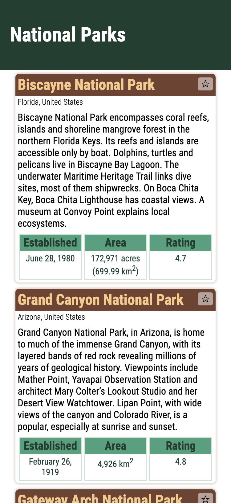
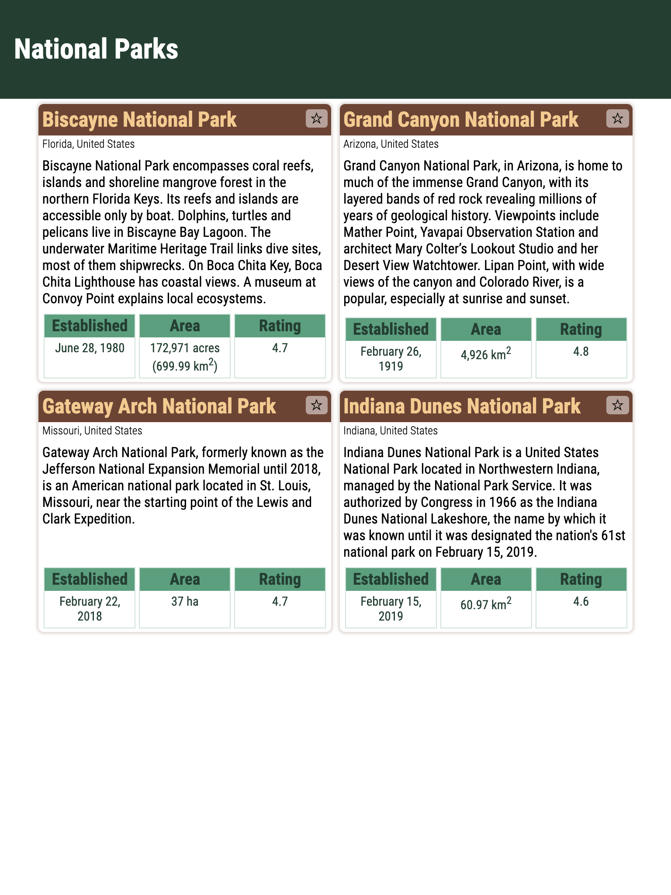
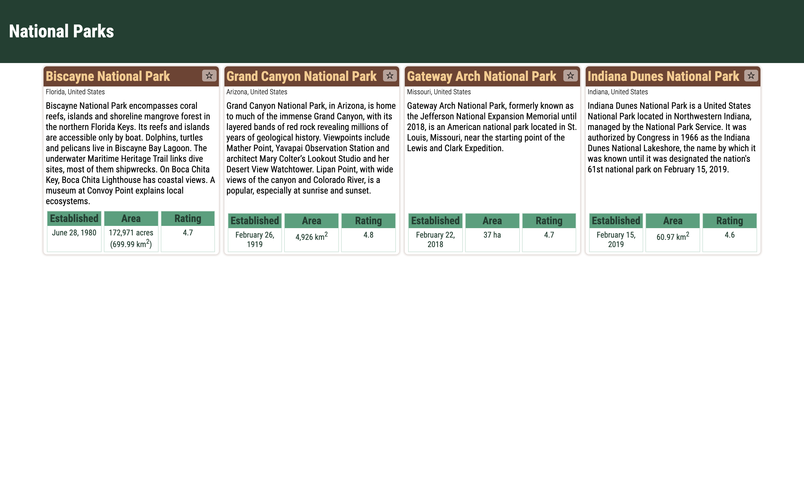

# National Parks

_Starter project for Front End Web Development JavaScript and the DOM module_

## Introduction

This starter project is used for illustrating the DOM and using JavaScript to interact with the DOM.

## View Demo

For a demonstration of the page visit [this link](https://thinkful-ed.github.io/starter-national-parks/).

## Getting started

Fork this repository then clone your fork to your local machine.

```bash
git clone https://github.com/<YOUR_GITHUB_USERNAME>/starter-national-parks.git
```

Navigate to the folder containing the repository and and open the folder in VS Code:

```bash
code .
```

Using VSCode, run the website with the [Live Server extension](https://marketplace.visualstudio.com/items?itemName=ritwickdey.LiveServer) that you installed in an earlier module.

## Screen Shots

The initial application should look like the following screenshots:







## License

This code is [MIT Licensed](LICENSE)
